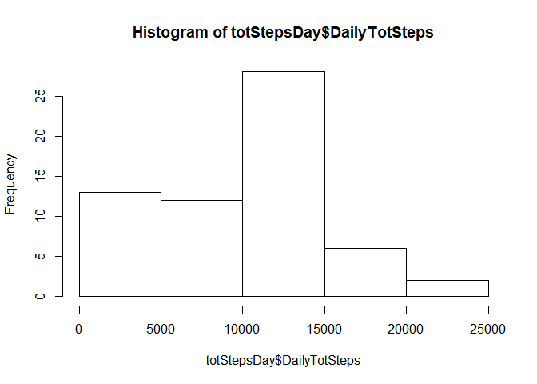
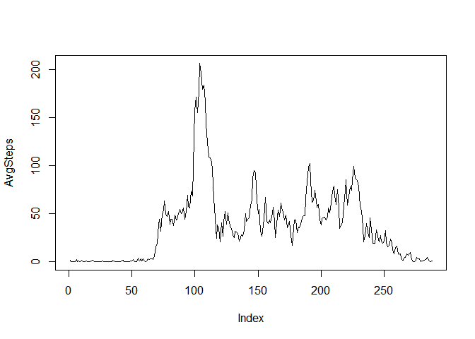
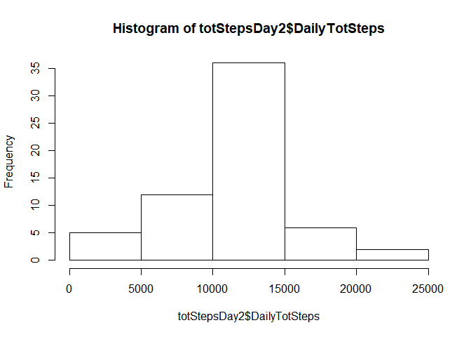
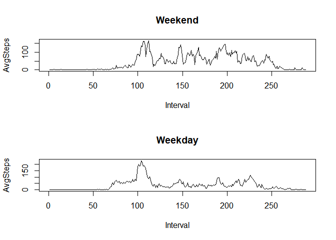

===================

This document combines code and explanation of work to complete the first project from the Reproducible Research course offered by Johns Hopkins University on Coursera.

## Loading and preprocessing the data

The data is included in the GitHub repository <http://github.com/rdpeng/RepData_PeerAssessment1>

We need to unzip the file and read the data:

```r
getwd()
```

```
## [1] "C:/Users/izlat/Documents/Reproducible Research JHU/RepData_PeerAssessment1"
```

```r
filename <- ("activity.zip")
unzip(filename)

# read data
library(data.table)
myData <- fread("activity.csv")
str(myData)
```

```
## Classes 'data.table' and 'data.frame':	17568 obs. of  3 variables:
##  $ steps   : int  NA NA NA NA NA NA NA NA NA NA ...
##  $ date    : chr  "2012-10-01" "2012-10-01" "2012-10-01" "2012-10-01" ...
##  $ interval: int  0 5 10 15 20 25 30 35 40 45 ...
##  - attr(*, ".internal.selfref")=<externalptr>
```

There are some NAs but we will ignore for now. Let's change the date column to a true Date data type

```r
library(lubridate)
```

```
## 
## Attaching package: 'lubridate'
```

```
## The following objects are masked from 'package:data.table':
## 
##     hour, isoweek, mday, minute, month, quarter, second, wday, week,
##     yday, year
```

```
## The following objects are masked from 'package:base':
## 
##     date, intersect, setdiff, union
```

```r
myData$date  <- ymd(myData$date) 
str(myData)
```

```
## Classes 'data.table' and 'data.frame':	17568 obs. of  3 variables:
##  $ steps   : int  NA NA NA NA NA NA NA NA NA NA ...
##  $ date    : Date, format: "2012-10-01" "2012-10-01" ...
##  $ interval: int  0 5 10 15 20 25 30 35 40 45 ...
##  - attr(*, ".internal.selfref")=<externalptr>
```

## What is mean total number of steps taken per day?

### Solution
1. Calculate the total number of steps taken per day: need to sum steps.


```r
totStepsDay <- myData[, .(DailyTotSteps = sum(steps, na.rm = TRUE)), by = date]
str(totStepsDay)
```

```
## Classes 'data.table' and 'data.frame':	61 obs. of  2 variables:
##  $ date         : Date, format: "2012-10-01" "2012-10-02" ...
##  $ DailyTotSteps: int  0 126 11352 12116 13294 15420 11015 0 12811 9900 ...
##  - attr(*, ".internal.selfref")=<externalptr>
```

2. Make a histogram of the total number of steps taken each day

```r
hist(totStepsDay$DailyTotSteps)
```

<!-- -->

3. Calculate and report the mean and median of the total number of steps taken per day - let's use summary:

```r
summary(totStepsDay$DailyTotSteps)
```

```
##    Min. 1st Qu.  Median    Mean 3rd Qu.    Max. 
##       0    6778   10395    9354   12811   21194
```

So we get mean = 9354 and median = 10395

## What is the average daily activity pattern?

### Solution
1. Make a time series plot (i.e. type = "l") of the 5-minute interval (x-axis) and the average number of steps taken, averaged across all days (y-axis)


```r
myTSPlotData <- myData[, .(AvgSteps = mean(steps, na.rm = TRUE)), by = interval]
with(myTSPlotData, plot(AvgSteps, type = "l"))
```

<!-- -->

2. Which 5-minute interval, on average across all the days in the dataset, contains the maximum number of steps?

```r
maxStepsInterval <- myTSPlotData[, .SD[which.max(AvgSteps)]]
maxStepsInterval
```

```
##    interval AvgSteps
## 1:      835 206.1698
```

Answer: Interval 835 has the highest number of steps.

## Imputing missing values

### Solution
1. Calculate and report the total number of missing values in the dataset (i.e. the total number of rows with NAs)

```r
sum(is.na(myData$steps))
```

```
## [1] 2304
```

We see that there are 2304 rows where steps have NA value.

2. Devise a strategy for filling in all of the missing values in the dataset could use the mean/median for that day, or the mean for that 5-minute interval 

Let's the second method, mean for that 5-minute interval.

3. Create a new dataset that is equal to the original dataset but with the missing data filled in

The approach: if steps in myData is NA, then assign AvgSteps from the average steps table created earlier, joining the two tables on interval 

```r
myData[myTSPlotData, steps := ifelse(is.na(steps), i.AvgSteps, steps), on = 'interval'] 
```

```
## Warning in `[.data.table`(myData, myTSPlotData, `:=`(steps,
## ifelse(is.na(steps), : 1.716981 (type 'double') at RHS position 1 truncated
## (precision lost) when assigning to type 'integer' (column 1 named 'steps')
```
There is a warning about precission loss because the averge is not an integer; that's ok, we're not splitting the atom here.

Let's check

```r
sum(is.na(myData))
```

```
## [1] 0
```


4. Make a histogram of the total number of steps taken each day. Calculate and report the mean and median total number of steps taken per day. Do these values differ from the estimates from the first part? What is the impact of imputing missing data on the estimates?

```r
totStepsDay2 <- myData[, .(DailyTotSteps = sum(steps)), by = date]
str(totStepsDay2)
```

```
## Classes 'data.table' and 'data.frame':	61 obs. of  2 variables:
##  $ date         : Date, format: "2012-10-01" "2012-10-02" ...
##  $ DailyTotSteps: int  10641 126 11352 12116 13294 15420 11015 10641 12811 9900 ...
##  - attr(*, ".internal.selfref")=<externalptr>
```

Let's look at the data:

```r
head(totStepsDay2, n = 20)
```

```
##           date DailyTotSteps
##  1: 2012-10-01         10641
##  2: 2012-10-02           126
##  3: 2012-10-03         11352
##  4: 2012-10-04         12116
##  5: 2012-10-05         13294
##  6: 2012-10-06         15420
##  7: 2012-10-07         11015
##  8: 2012-10-08         10641
##  9: 2012-10-09         12811
## 10: 2012-10-10          9900
## 11: 2012-10-11         10304
## 12: 2012-10-12         17382
## 13: 2012-10-13         12426
## 14: 2012-10-14         15098
## 15: 2012-10-15         10139
## 16: 2012-10-16         15084
## 17: 2012-10-17         13452
## 18: 2012-10-18         10056
## 19: 2012-10-19         11829
## 20: 2012-10-20         10395
```

Now it's time for the new histogram:

```r
hist(totStepsDay2$DailyTotSteps)
```

<!-- -->

Looks closer to a normal distribution than the first histogram - imputing values did have an impact.


```r
summary(totStepsDay2$DailyTotSteps)
```

```
##    Min. 1st Qu.  Median    Mean 3rd Qu.    Max. 
##      41    9819   10641   10750   12811   21194
```

And we see that the mean and median both increased. New median is 10641 and new mean = 10750.

## Are there differences in activity patterns between weekdays and weekends?

### Solution
For this part the weekdays() function may be of some help here.
1. Create a new factor variable in the dataset with two levels – “weekday” and “weekend” 
Let's get the weekdays first in a new column and make sure they are a factor:

```r
myData[, Weekday := weekdays(date) ]
myData$Weekday <- factor(myData$Weekday)
levels(myData$Weekday)
```

```
## [1] "Friday"    "Monday"    "Saturday"  "Sunday"    "Thursday"  "Tuesday"  
## [7] "Wednesday"
```

Looks right. Now we need to get weekday vs. weekend. I'll do this in a column called Workday. To recode our Weekday factor, I'll use the car package.

```r
#install.packages("car")
library(car)
```

```
## Loading required package: carData
```

```r
myData[, Workday := recode(Weekday, " c('Saturday', 'Sunday') = 'weekend'; 
                                        c('Monday', 'Tuesday', 'Wednesday', 'Thursday', 'Friday') = 'weekday' ") ]
str(myData)
```

```
## Classes 'data.table' and 'data.frame':	17568 obs. of  5 variables:
##  $ steps   : int  1 0 0 0 0 2 0 0 0 1 ...
##  $ date    : Date, format: "2012-10-01" "2012-10-01" ...
##  $ interval: int  0 5 10 15 20 25 30 35 40 45 ...
##  $ Weekday : Factor w/ 7 levels "Friday","Monday",..: 2 2 2 2 2 2 2 2 2 2 ...
##  $ Workday : Factor w/ 2 levels "weekday","weekend": 1 1 1 1 1 1 1 1 1 1 ...
##  - attr(*, ".internal.selfref")=<externalptr>
```

Ok, now we are ready to move on.

2. Make a panel plot containing a time series plot (i.e. type = "l") of the 5-minute interval (x-axis) and the average number of steps taken, averaged across all weekday days or weekend days (y-axis).

First, let's split data on weekend and weekday, starting with weekend:

```r
myFinalPlotData <- myData[, .(AvgSteps = mean(steps)), by = .(interval, Workday)]
weekendData <- subset(myFinalPlotData, myFinalPlotData[, Workday == "weekend"])
str(weekendData)
```

```
## Classes 'data.table' and 'data.frame':	288 obs. of  3 variables:
##  $ interval: int  0 5 10 15 20 25 30 35 40 45 ...
##  $ Workday : Factor w/ 2 levels "weekday","weekend": 2 2 2 2 2 2 2 2 2 2 ...
##  $ AvgSteps: num  0.125 0 0 0 0 3.5 0 0 0 0.5 ...
##  - attr(*, ".internal.selfref")=<externalptr>
```

Now subset the weekdays


```r
weekdayData <- subset(myFinalPlotData, myFinalPlotData[, Workday == "weekday"])        
str(weekdayData)
```

```
## Classes 'data.table' and 'data.frame':	288 obs. of  3 variables:
##  $ interval: int  0 5 10 15 20 25 30 35 40 45 ...
##  $ Workday : Factor w/ 2 levels "weekday","weekend": 1 1 1 1 1 1 1 1 1 1 ...
##  $ AvgSteps: num  2.1556 0.4 0.1556 0.1778 0.0889 ...
##  - attr(*, ".internal.selfref")=<externalptr>
```

And here is the final panel plot:

```r
par(mfrow = c(2, 1))
with(weekendData , plot(AvgSteps, xlab = "Interval", type = "l", main = "Weekend"))
with(weekdayData , plot(AvgSteps, xlab = "Interval", type = "l", main = "Weekday"))
```

<!-- -->

As the plots show, there are differences between weekend and weekday steps patterns.

